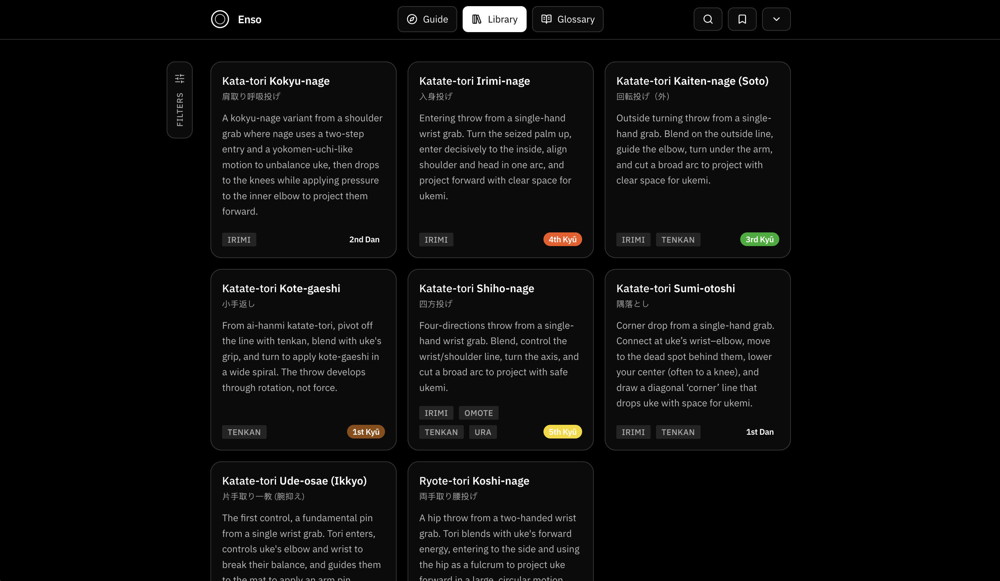

# Enso — Aikidō Study Companion

A calm, bilingual (EN/DE) Progressive Web App for studying Aikidō: searchable techniques, terms, exam guides, and local-first bookmarks.



**Local-first:** no accounts • bookmarks & preferences stay on your device

## Table of contents

- [What you can do](#what-you-can-do)
- [Features](#features)
- [Content model](#content-model)
- [Tech stack](#tech-stack)
- [Getting started](#getting-started)
- [Project structure](#project-structure)
- [Content workflow](#content-workflow)
- [Feedback → GitHub Issues](#feedback--github-issues)
- [Contributing](#contributing)
- [License](#license)

## What you can do

- Find techniques quickly (filters + spotlight search)
- Learn from a consistent technique layout: Steps, Uke, Common Mistakes, Context, Media
- Compare entries/stances/variants without splitting into dozens of pages
- Browse a clean terms page (terms, attacks, etiquette, philosophy)
- Save techniques/terms to bookmark collections for your training goals
- Use exam/program guides as a quick reference before class

## Features

### Techniques

- Technique library with filters (attack, level/grade, weapon, stance/hanmi, etc.)
- Technique pages with structured sections:
  - **Steps** (by entry: irimi/tenkan/omote/ura)
  - **Uke** role + safety notes
  - **Common Mistakes**
  - **Context** (when/why)
  - **Media** (links, optional)
- Variant-friendly modeling (base + versions/lines + entry modes) to avoid duplicated pages

### Search

- Spotlight-style search overlay
- Weighted ranking across techniques, terms, and collections
- Keyboard-friendly navigation

### Terms

- Filterable term list + detail pages
- Short definitions + optional literal translation and longer notes
- EN/DE copy for every term

### Bookmarks & collections

- Bookmark techniques and terms
- Organize into collections
- Track personal progress over time

### Guides

- Exam/program pages and matrices (kyū/dan and weapon basics)

### PWA

- Installable Progressive Web App
- Designed for fast, readable use on mobile before training

## Content model

Enso is **content-driven**.

- Canonical content lives in `content/` as JSON.
- The app consumes typed content in `src/shared/types/`.

Main content areas:

- Techniques: `content/techniques/*.json`
- Terms: `content/terms/*.json`
- Trainers / dojos: `content/trainers.json`, `content/dojos.json`
- Quotes: `content/quotes.json`, `content/quotes-de.json`

### Technique JSON (concept)

Techniques are modeled around:

- Core metadata (name, category, attack, weapon, grade)
- Multiple **versions** (e.g., base + trainer/dojo interpretations)
- Steps grouped by **entry mode** (`irimi`, `tenkan`, `omote`, `ura`)

See `src/shared/types/content.ts` (and related types) for the current canonical shape.

### Terms JSON (concept)

Terms include:

- `romaji`, optional `jp`
- short definition (EN/DE)
- optional literal translation and longer notes

## Tech stack

- React + TypeScript + Vite
- Tailwind CSS
- Zustand (client state + local persistence via `storageService`)
- Framer Motion (subtle UI motion)
- PWA manifest + install support
- Vercel (hosting) + serverless API route for feedback

## Getting started

```bash
pnpm install
pnpm dev
# open http://localhost:5173
```

Build + preview:

```bash
pnpm build
pnpm preview
```

## Project structure

High-level layout:

- `src/`
  - `features/`
    - `technique/` — techniques + technique pages + toolbar
    - `search/` — indexer + scorer + overlay UI
    - `terms/` — terms pages, filters, detail views
    - `exercises/` — exercises pages, filters, detail views
    - `bookmarks/` — collections + bookmark UI + local progress
    - `home/` — landing, guides, settings, feedback
  - `shared/`
    - `services/storageService.ts` — local persistence
    - `store/` — app-wide state
    - `types/` — content + app types
    - `components/` — reusable UI (modals, toasts, selects, layout)
- `content/` — canonical JSON + assets
- `scripts/build-content.ts` — content build/validation utility
- `api/feedback.ts` — serverless endpoint for feedback submissions
- `public/` — fonts, icons, `manifest.json`

## Content workflow

1. Edit JSON in `content/` (techniques or terms).
2. Validate/build content:

```bash
pnpm run build
# or run the content script directly if needed
# node scripts/build-content.ts
```

Notes:

- Keep EN/DE fields in sync.
- Prefer concise, actionable steps (4–8 cues per entry).
- Media is link-based (no uploads).

## Feedback → GitHub Issues

Enso includes an in-app feedback flow that posts to `/api/feedback`.

- Payloads are validated server-side
- When GitHub credentials are configured, submissions can open a labeled GitHub Issue

Local dev without GitHub configured should still let you test the UX (the API can respond with a warning).

To enable issue creation, add a `.env.local` (git-ignored) and set:

```bash
GITHUB_TOKEN=***
GITHUB_OWNER=your-user-or-org
GITHUB_REPO=your-repo
```

Then mirror the same variables in Vercel.

## Contributing

PRs and content improvements are welcome.

- Keep changes small and reviewable
- Follow existing TypeScript types (single source of truth)
- Prefer structured content (JSON) over freeform text
- If you add new term/technique files, keep IDs/slugs stable and unique

## License

Original work by Kyle Brooks. See `LICENSE` and `NOTICE`.
